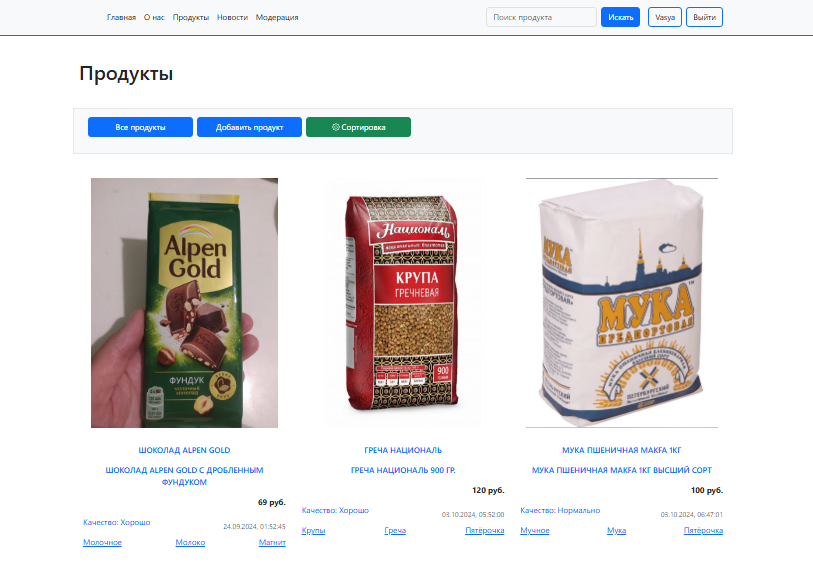
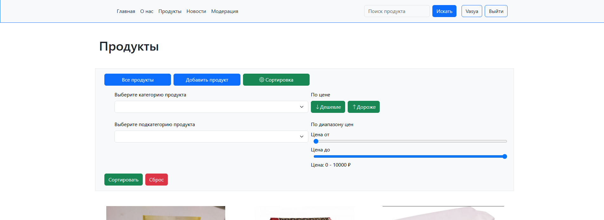
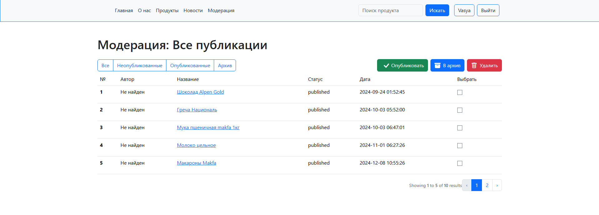

# NormalProduct

## Цель приложения **Нормальный продукт** - создать независимую площадку потребителей пищевых продуктов, где они смогут делится обзорами на приобретеённые продукты, отслеживать хорошие и плохие продукты, читать новости связанные с пищевым вопросом т.п. 

Данная версия - готовый прототип для публикации и дальнейшей разработки.

Основные используемые технологии проекта:

Backend: Laravel, Blade, LaravelBreeze.

Frontend: Bootstrap, Vue 3.

Применяется технология Ajax для фильтрации продуктов без перезагрузки страницы. 

**В приложении присутствуют следующие возможности: просмотр, внесение продуктов (для авторизованных пользователей), регистрация, авторизация, фильтрация имеющихся продуктов, примитивный поиск по продуктам.**

**Также имеется функция для админа - модерация поступающих продуктов от пользователей в админ-панели. Изначально все новые продукты поступают на модерацию. Доступ к админке в 5 пункте установки.**


## Установка

1. Клонируйте репозиторий:
   ```sh
   git clone https://github.com/LeonidRed17/normalProduct.git

2. Установите зависимости:
   ```sh
   composer install

   npm install

3. Загрузите дамп базы данных mysql:
   ```sh
   normalproduct.sql

4. Запустите сервер:
    ```sh
    artisan serve / npm run dev

5. Готово!
    ```sh
    Чтобы попробовать проект в качестве админа (например чтобы попробовать функцию модерации, или просто добавить продукт):

    Логин: vasiliy123@yandex.ru
    Пароль: 12345678

    По идее всё должно работать :)

## Скриншоты

### Продукты


### Фильтры


### Модерация
